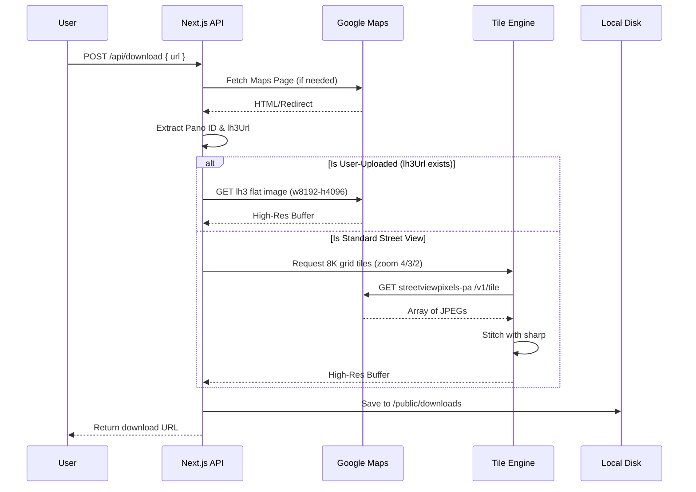

# PanoFetch

A minimalist, high-performance web application to extract and download high-resolution 360° Street View panoramas from Google Maps links. 

## Features
- **Zero Database Architecture**: Processes everything in memory and streams directly to disk.
- **Smart Pano ID Extraction**: Reverse-engineers Google Maps URLs to extract internal panorama IDs, including user-uploaded Photo Spheres (`lh3.googleusercontent.com`).
- **Tile Stitching Engine**: Automatically downloads grid tiles for standard Google panoramas and stitches them into a single equirectangular high-resolution image using `sharp`.
- **Direct Flat Extraction**: Detects user-uploaded photospheres and bypasses the tiling engine to fetch the native 8K flat image directly.

---

## Architecture Diagram



## Getting Started

1. **Install Dependencies**
   ```bash
   npm install
   ```

2. **Run the Development Server**
   ```bash
   npm run dev
   ```

3. **Usage**
   Open `http://localhost:3000`, paste a Google Maps Street View URL, and click "Extract".

## Technologies Used
- Next.js (App Router)
- React & Tailwind CSS
- Sharp (Image Stitching)
- Axios (HTTP Client)
