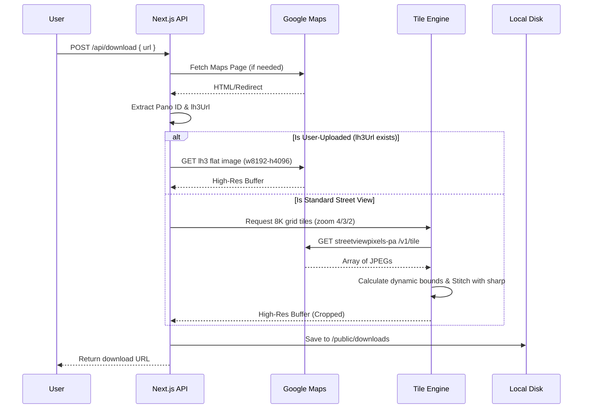

# PanoFetch ✦

A minimalist, high-performance web application to extract and download high-resolution 360° Street View panoramas from Google Maps links. Designed with a sleek, Swiss/Vercel-inspired monochrome UI, it prioritizes speed, precision, and aesthetics.

---

## Table of Contents
1. [Overview](#overview)
2. [Features](#features)
3. [Architecture & Workflow](#architecture--workflow)
4. [Getting Started](#getting-started)
5. [How It Works (Deep Dive)](#how-it-works-deep-dive)
6. [Technologies Used](#technologies-used)
7. [License](#license)

---

## Overview
PanoFetch eliminates the need for a paid Google Maps API key by smartly extracting internal panorama IDs and direct asset URLs from public Google Maps links. It provides users with a raw, high-resolution equirectangular image (up to 8K) ready for use in 3D modeling, VR, or archival purposes.

## Features
- **Zero Database Architecture**: Processes everything in memory and streams directly to disk. No external DB required.
- **Smart Pano ID Extraction**: Reverse-engineers Google Maps URLs to extract internal panorama IDs, seamlessly handling both standard links and short links.
- **Direct Flat Extraction (`lh3`)**: Detects user-uploaded Photo Spheres (`lh3.googleusercontent.com`) and bypasses the tiling engine entirely to fetch the native 8K flat image in a single, lightning-fast request.
- **Intelligent Tile Stitching**: Automatically downloads grid tiles for standard Google panoramas, crops out empty "black void" regions dynamically, and stitches them into a single high-resolution image using `sharp`.
- **Sleek UI/UX**: A dark-mode, Vercel-inspired minimalist interface designed for focus.

---

## Architecture & Workflow



---

## Getting Started

### Prerequisites
- Node.js 18+
- npm or yarn

### Installation
1. **Clone the repository** (if applicable)
2. **Install Dependencies**
   ```bash
   npm install
   ```

3. **Run the Development Server**
   ```bash
   npm run dev
   ```

4. **Usage**
   Open `http://localhost:3000`, paste any Google Maps Street View URL (e.g., a specific location in Shibuya or Los Angeles), and click "Extract".

---

## How It Works (Deep Dive)

### ID Extraction (`extractPano.ts`)
Google Maps URLs can take many forms. PanoFetch attempts to:
1. Extract the ID directly from URL parameters (e.g., `!1s[ID]`).
2. If it's a short link (`goo.gl`), it fetches the URL to follow redirects and parses the final URL.
3. If the ID is hidden in the page source, it parses the `window.APP_INITIALIZATION_STATE` block in the HTML payload.
4. Concurrently, it watches for `lh3.googleusercontent.com` thumbnail URLs.

### Processing (`route.ts` & `stitchTiles.ts`)
- **lh3 Direct**: If the pano is user-uploaded, the app strips the low-res size parameters from the thumbnail URL and requests `w8192-h4096-k-no` to retrieve the original 8K file directly.
- **Tile Stitching**: For official Google cars, the app calculates the grid coordinates for zoom level 4 (or falls back to 3 or 2). It downloads all 512x512 tiles concurrently.
- **Dynamic Cropping**: Instead of rendering a fixed grid that might result in black borders for partial panoramas, the stitcher calculates the exact maximum `x` and `y` tile coordinates successfully downloaded and crops the final canvas to match perfectly.

---

## Technologies Used
- **Framework**: [Next.js](https://nextjs.org/) (App Router)
- **Styling**: [Tailwind CSS v4](https://tailwindcss.com/)
- **Image Processing**: [Sharp](https://sharp.pixelplumbing.com/)
- **HTTP Client**: [Axios](https://axios-http.com/)
- **Icons**: [Lucide React](https://lucide.dev/) & `next/og` (Dynamic programmatic SVGs)

---

## License
MIT License. Free to use and modify.
